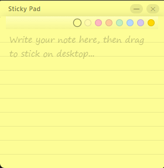

# Sticky


Desktop sticky notes app built with [Tauri 2](https://v2.tauri.app/) + React + TypeScript.

Write notes on a pad, tear them off, and they stick to your desktop — just like real sticky notes. Write once, read forever, ~~only deletable~~.

<br clear="left">

## Screenshot



## Features

- **Tear-off flow** — write on the main pad, drag out to create a posted sticky on the desktop
- **Task list support** — `- [ ]` / `-【】` syntax rendered as hand-drawn checkboxes with toggle
- **Double-click to edit** — double-click a posted sticky to modify its content, blur to save
- **Always on bottom** — sticky windows sit beneath all other windows, pinned to the desktop
- **Pin to lock** — pin a sticky to fix it in place, prevent accidental moves and edits
- **Transparent windows** — only the note card is visible, creating a natural desk feel
- **System tray** — left-click to show/hide, right-click menu for Show/Hide and Quit
- **Single instance** — launching again focuses the existing window
- **Persistence** — posted stickies survive restarts; window positions and sizes are restored
- **Font scaling** — Ctrl + scroll in the editor to adjust text size (10–24px)
- **DPI aware** — properly handles display scaling (100%–200%)

## Prerequisites

- [Node.js](https://nodejs.org/) (18+)
- [Rust](https://www.rust-lang.org/) (latest stable)
- Windows 10 / 11

## Quick Start

```bash
npm install
npm run tauri dev
```

## Build

```bash
npm run tauri build
```

The installer will be in `src-tauri/target/release/bundle/`.

## Usage

| Action | How |
|--------|------|
| Write a note | Type in the textarea on the main pad |
| Change color | Click a color dot on the adhesive strip |
| Post to desktop | Click the note card and drag out |
| Edit a posted sticky | Double-click the content area |
| Move a sticky | Drag the adhesive strip (when unpinned) |
| Pin / Unpin | Hover over sticky, click 📌 |
| Complete a task | Click the checkbox on a task line |
| Create a task | Type `- [ ] task` or `-【】task` or `[] task`|
| Delete a sticky | Hover over sticky, click ✕ |
| Adjust font size | Ctrl + scroll while editing |
| Hide to tray | Click ✕ on the note header |
| Quit | Right-click tray icon → Quit |

## Tech Stack

| Layer | Stack |
|-------|-------|
| Framework | Tauri 2 |
| Frontend | React 19 + TypeScript + Vite |
| Styling | Plain CSS |
| Plugins | `window-state`, `opener`, `single-instance` |

## Project Structure

```
src/
  App.tsx                    # Entry routing (main pad vs sticky window)
  App.css                    # Global styles
  types.ts                   # Shared types & constants
  main.tsx                   # React mount point
  components/
    StickyPad.tsx             # Main writing pad window
    StickyNote.tsx            # Posted sticky window
src-tauri/
  src/
    main.rs                   # Rust entry point
    lib.rs                    # Tauri builder, tray icon, plugin setup
    commands.rs               # create_sticky, move_sticky, delete_sticky
    window_utils.rs           # Win32 always-on-bottom
  Cargo.toml
  tauri.conf.json
```

## License

MIT
